# Azure OpenAI PR Review Action - Architecture

This GitHub Action uses Azure OpenAI to automatically review Pull Requests and provide intelligent feedback using SOLID principles and clean architecture.

## 🔄 Complete System Flow Diagram

```mermaid
flowchart TB
    %% GitHub Events Layer
    subgraph "🐙 GitHub Event System"
        direction TB
        PR_EVENT[📝 Pull Request Event<br/>opened<br/>synchronize<br/>reopened]
        WEBHOOK[🔔 GitHub Webhook]
        PR_EVENT --> WEBHOOK
    end
    
    %% GitHub Actions Workflow Layer  
    subgraph "⚙️ GitHub Actions Workflow (.github/workflows/pr-review.yml)"
        direction TB
        TRIGGER[🎯 Workflow Trigger<br/>on: pull_request]
        PERMISSIONS[🔐 Set Permissions<br/>contents: read<br/>pull-requests: write<br/>issues: write]
        CHECKOUT[📥 Checkout Code<br/>actions/checkout@v4]
        CUSTOM_ACTION[🎭 Custom Action<br/>uses: ./action.yml]
        COMMENT_STEP[💬 Comment on PR<br/>actions/github-script@v7]
        
        TRIGGER --> PERMISSIONS
        PERMISSIONS --> CHECKOUT
        CHECKOUT --> CUSTOM_ACTION
        CUSTOM_ACTION --> COMMENT_STEP
    end
    
    %% Custom Action Layer (action.yml)
    subgraph "🐳 Docker Action (action.yml)"
        direction TB
        ACTION_INPUTS[📋 Action Inputs<br/>azure_openai_endpoint<br/>azure_openai_api_key<br/>deployment_name<br/>max_tokens<br/>temperature]
        DOCKER_RUN[🐳 Docker Container<br/>using: docker<br/>image: Dockerfile]
        ENV_VARS[🌍 Environment Variables<br/>From GitHub Secrets]
        ACTION_OUTPUTS[📤 Action Outputs<br/>summary<br/>score<br/>approved<br/>review_result JSON]
        
        ACTION_INPUTS --> ENV_VARS
        ENV_VARS --> DOCKER_RUN
        DOCKER_RUN --> ACTION_OUTPUTS
    end
    
    %% Python Application Layer
    subgraph "🐍 Python Application (src/)"
        direction TB
        
        %% Entry Point
        MAIN_PY[🚀 main.py<br/>Entry Point & Orchestrator]
        
        %% Data Extraction
        subgraph "📊 Data Layer"
            PR_DATA[📄 PullRequestData<br/>number, title, body<br/>author, branches<br/>files_changed]
            FILE_CHANGE[📁 FileChange<br/>filename, status<br/>additions, deletions<br/>patch content]
        end
        
        %% Service Layer
        subgraph "🔧 Service Layer"
            PR_SERVICE[🛠️ PRReviewService<br/>Orchestrates review<br/>Validates PR data<br/>Loads configuration]
        end
        
        %% AI Provider Layer
        subgraph "🧠 AI Provider Layer"
            AI_INTERFACE[🎭 AIProvider Interface<br/>Abstract base class]
            AZURE_PROVIDER[☁️ AzureOpenAIProvider<br/>Implements AIProvider<br/>Handles retry logic<br/>Parses responses]
        end
        
        %% Results Layer
        subgraph "📋 Results Layer"
            REVIEW_RESULT[📊 ReviewResult<br/>summary<br/>overall_score<br/>approved<br/>comments array]
            REVIEW_COMMENT[💭 ReviewComment<br/>filename<br/>line_number<br/>message<br/>severity]
        end
        
        MAIN_PY --> PR_DATA
        MAIN_PY --> PR_SERVICE
        PR_SERVICE --> AI_INTERFACE
        AI_INTERFACE --> AZURE_PROVIDER
        AZURE_PROVIDER --> REVIEW_RESULT
        REVIEW_RESULT --> REVIEW_COMMENT
    end
    
    %% External Services
    subgraph "☁️ Azure Cloud Services"
        AZURE_OPENAI[🤖 Azure OpenAI API<br/>GPT-4 Analysis<br/>Code Review<br/>Structured Response]
        AZURE_AUTH[🔐 Azure Authentication<br/>API Key validation<br/>Endpoint routing]
    end
    
    %% Output Processing
    subgraph "📤 Output Processing"
        GITHUB_OUTPUT[📝 GitHub Actions Output<br/>$GITHUB_OUTPUT file]
        JSON_RESULT[📋 Structured JSON Result<br/>Complete review data]
        FORMATTED_COMMENT[💬 Formatted PR Comment<br/>Markdown with emojis]
    end
    
    %% Data Flow Connections
    WEBHOOK --> TRIGGER
    CUSTOM_ACTION --> DOCKER_RUN
    DOCKER_RUN --> MAIN_PY
    AZURE_PROVIDER -.->|HTTP Request| AZURE_OPENAI
    AZURE_OPENAI -.->|JSON Response| AZURE_PROVIDER
    REVIEW_RESULT --> GITHUB_OUTPUT
    GITHUB_OUTPUT --> JSON_RESULT
    JSON_RESULT --> FORMATTED_COMMENT
    FORMATTED_COMMENT --> COMMENT_STEP
    
    %% Styling
    classDef githubEvent fill:#e1f5fe,stroke:#01579b,stroke-width:2px
    classDef workflow fill:#f3e5f5,stroke:#4a148c,stroke-width:2px  
    classDef docker fill:#fff3e0,stroke:#e65100,stroke-width:2px
    classDef python fill:#e8f5e8,stroke:#1b5e20,stroke-width:2px
    classDef azure fill:#fff8e1,stroke:#ff6f00,stroke-width:2px
    classDef output fill:#fce4ec,stroke:#880e4f,stroke-width:2px
    
    class PR_EVENT,WEBHOOK githubEvent
    class TRIGGER,PERMISSIONS,CHECKOUT,CUSTOM_ACTION,COMMENT_STEP workflow
    class ACTION_INPUTS,DOCKER_RUN,ENV_VARS,ACTION_OUTPUTS docker
    class MAIN_PY,PR_DATA,FILE_CHANGE,PR_SERVICE,AI_INTERFACE,AZURE_PROVIDER,REVIEW_RESULT,REVIEW_COMMENT python
    class AZURE_OPENAI,AZURE_AUTH azure
    class GITHUB_OUTPUT,JSON_RESULT,FORMATTED_COMMENT output
```



## Component Architecture (SOLID Principles)


## Data Flow

1. **Trigger**: PR events (opened, synchronize, reopened) trigger the workflow
2. **Environment**: GitHub Actions runs the Docker container with environment variables
3. **Initialization**: Python app reads GitHub context and Azure OpenAI credentials
4. **Data Extraction**: Pull Request information is extracted (files, changes, metadata)
5. **AI Analysis**: Azure OpenAI analyzes the code changes and provides feedback
6. **Result Processing**: AI response is parsed into structured review results
7. **Output**: Results are formatted and posted as PR comments and action outputs

## Key Features

- **SOLID Principles**: Clean separation of concerns with dependency injection
- **Azure Integration**: Secure connection to Azure OpenAI with retry logic
- **Error Handling**: Comprehensive error handling with exponential backoff
- **Configurable**: Customizable AI parameters (temperature, max tokens, etc.)
- **Extensible**: Interface-based design allows for multiple AI providers
- **GitHub Integration**: Native GitHub Actions integration with proper permissions

## Configuration

The action requires these secrets to be configured in your repository:
- `AZURE_OPENAI_ENDPOINT`: Your Azure OpenAI endpoint URL
- `AZURE_OPENAI_API_KEY`: Your Azure OpenAI API key  
- `AZURE_OPENAI_DEPLOYMENT_NAME`: Your model deployment name (e.g., "gpt-4")

## 🔄 Detailed Execution Sequence


## 🏗️ Architecture Components Deep Dive

### 📋 1. GitHub Actions Workflow (`.github/workflows/pr-review.yml`)

**Purpose**: Orchestrates the entire review process when PR events occur.

**Key Features**:
- **Event Trigger**: Responds to `pull_request` events (opened, synchronize, reopened)
- **Permission Management**: Explicitly grants necessary permissions for commenting
- **Error Handling**: Includes fallback commenting strategy if main process fails
- **Secret Management**: Securely passes Azure OpenAI credentials to the action

```yaml
# Key workflow configuration
on:
  pull_request:
    types: [opened, synchronize, reopened]  # Specific PR events

permissions:
  contents: read          # Read repository contents
  pull-requests: write    # Comment on PRs  
  issues: write          # Create issue comments
```

### 📦 2. Custom Action Definition (`action.yml`)

**Purpose**: Defines the containerized action that GitHub Actions can execute.

**Input/Output Contract**:
```yaml
# Inputs from GitHub Secrets
inputs:
  azure_openai_endpoint:    # Azure OpenAI service URL
  azure_openai_api_key:     # Authentication key
  azure_openai_deployment_name: # Model deployment (e.g., "gpt-4")
  max_tokens:               # Response length limit
  temperature:              # AI creativity setting

# Outputs for workflow consumption  
outputs:
  summary:                  # Brief review summary
  score:                   # Numerical score (1-10)
  approved:                # Boolean approval status
  review_result:           # Complete JSON result
```

### 🐳 3. Docker Container (`Dockerfile`)

**Purpose**: Provides isolated, consistent execution environment.

**Container Features**:
- **Base Image**: `python:3.11-slim` for minimal footprint
- **Dependency Management**: Installs requirements during build
- **Python Path**: Configured for module execution
- **Entry Point**: Executes `src.main` module

### 🐍 4. Python Application Architecture

#### 📌 Entry Point (`src/main.py`)
- **Role**: Main orchestrator following SOLID principles
- **Responsibilities**:
  - Environment variable processing
  - Dependency injection setup
  - Error handling and logging
  - GitHub Actions output formatting

#### 🎭 Interface Layer (`src/interfaces/ai_provider.py`)
- **Purpose**: Abstract contract for AI providers (Dependency Inversion Principle)
- **Benefits**: Allows switching between different AI services without code changes
- **Design**: Defines `analyze_pull_request()` method signature

#### 🧠 Provider Layer (`src/providers/azure_openai_provider.py`)
- **Role**: Concrete implementation of Azure OpenAI integration
- **Features**:
  - **Retry Logic**: Exponential backoff for API failures
  - **Error Handling**: Graceful degradation with fallback responses
  - **Response Parsing**: Converts AI output to structured results
  - **Security**: Secure credential handling

#### 🛠️ Service Layer (`src/services/pr_review_service.py`)
- **Role**: Business logic orchestration (Single Responsibility Principle)
- **Functions**:
  - Configuration management
  - PR data validation
  - Review process coordination

#### 📊 Model Layer (`src/models/`)
- **Purpose**: Immutable data structures (frozen dataclasses)
- **Models**:
  - `PullRequestData`: PR metadata and file changes
  - `ReviewResult`: AI analysis results and recommendations
  - `FileChange`: Individual file modification details
  - `ReviewComment`: Specific feedback items

## 🔧 Technical Implementation Details

### 🔄 Data Flow Patterns

1. **Event-Driven Architecture**: GitHub webhooks trigger the entire process
2. **Dependency Injection**: Services receive dependencies rather than creating them
3. **Immutable Data**: Models use `frozen=True` to prevent accidental mutations
4. **Error Boundaries**: Each layer handles its own errors with appropriate fallbacks

### 🔐 Security Considerations

- **Secret Management**: Credentials stored in GitHub Secrets, not code
- **Least Privilege**: GitHub token has minimal required permissions
- **Input Validation**: PR data validated before processing
- **API Security**: Azure OpenAI calls use secure authentication

### 📈 Scalability Features

- **Configurable Limits**: Token limits, file counts, patch sizes
- **Async Processing**: Async/await pattern for better resource utilization
- **Retry Logic**: Handles temporary Azure OpenAI service issues
- **Modular Design**: Easy to extend with new AI providers or features

### 🎯 SOLID Principles in Action

1. **Single Responsibility**: Each class has one clear purpose
   - `PRReviewService`: Only orchestrates reviews
   - `AzureOpenAIProvider`: Only handles Azure OpenAI communication
   - `PullRequestData`: Only holds PR information

2. **Open/Closed**: Open for extension, closed for modification
   - New AI providers can be added without changing existing code
   - New review templates can be implemented via configuration

3. **Liskov Substitution**: Implementations are interchangeable
   - Any `AIProvider` implementation can replace `AzureOpenAIProvider`
   - Review process remains unchanged

4. **Interface Segregation**: Focused, minimal interfaces
   - `AIProvider` only defines AI analysis contract
   - No forced implementation of unused methods

5. **Dependency Inversion**: High-level modules depend on abstractions
   - `PRReviewService` depends on `AIProvider` interface, not concrete implementation
   - Easy to mock for testing

## 🚀 Deployment and Usage

### Prerequisites
1. **Azure OpenAI Service**: Set up Azure OpenAI with model deployment
2. **GitHub Repository**: Configure secrets and enable Actions
3. **Repository Permissions**: Ensure Actions can comment on PRs

### Configuration Steps
1. **Add Repository Secrets**:
   - `AZURE_OPENAI_ENDPOINT`: Your Azure OpenAI endpoint URL
   - `AZURE_OPENAI_API_KEY`: Your Azure OpenAI API key  
   - `AZURE_OPENAI_DEPLOYMENT_NAME`: Your model deployment name (e.g., "gpt-4")

2. **Enable GitHub Actions**: Ensure Actions are enabled in repository settings

3. **Workflow Placement**: Ensure `.github/workflows/pr-review.yml` is in the repository

### Usage Flow
1. **Developer creates/updates PR**: Triggers the workflow automatically
2. **AI Analysis**: Azure OpenAI analyzes the code changes
3. **Review Comment**: Formatted feedback posted as PR comment
4. **Structured Output**: Machine-readable results available for other workflow steps

This architecture provides a robust, extensible foundation for AI-powered code reviews while maintaining clean code principles and production-ready error handling.

## 📋 System Summary

This Azure OpenAI PR Review Agent is a **production-ready GitHub Action** that demonstrates modern software engineering principles:

### 🎯 **Core Functionality**
- **Automated PR Analysis**: Uses Azure OpenAI GPT models to review code changes
- **Intelligent Feedback**: Provides structured comments on quality, security, and performance
- **GitHub Integration**: Seamlessly integrates with GitHub's PR workflow
- **Error Resilience**: Comprehensive error handling with graceful degradation

### 🏗️ **Architecture Highlights**
- **SOLID Principles**: Every component follows single responsibility and dependency inversion
- **Clean Architecture**: Clear separation between interfaces, business logic, and infrastructure
- **Containerization**: Docker ensures consistent execution across environments
- **Security-First**: Secure credential handling and minimal privilege access

### 🔄 **Integration Points**
1. **GitHub Events** → Webhook triggers on PR activities
2. **GitHub Actions** → Orchestrates workflow execution  
3. **Docker Container** → Provides isolated execution environment
4. **Azure OpenAI** → Powers intelligent code analysis
5. **GitHub API** → Posts formatted review comments

### 📊 **Data Flow**
```
PR Creation → Workflow Trigger → Docker Execution → AI Analysis → Structured Results → PR Comments
```

### 🚀 **Deployment Ready**
- Repository secrets for secure configuration
- Workflow permissions properly configured  
- Error handling with fallback strategies
- Local development and testing support

This system serves as an excellent **reference implementation** for:
- Building GitHub Actions with clean architecture
- Integrating AI services securely in CI/CD pipelines
- Applying SOLID principles in real-world applications
- Creating production-ready containerized applications

The codebase is **extensible by design**, making it easy to add new AI providers, review templates, or analysis features while maintaining architectural integrity.
