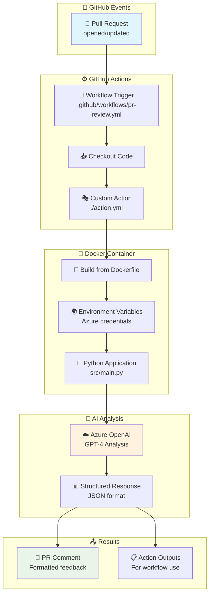

# 🤖 Azure OpenAI PR Review Agent

An intelligent, automated Pull Request review system powered by Azure OpenAI and built with clean architecture principles.

## 🎯 What This Project Does

This GitHub Action automatically reviews Pull Requests using Azure OpenAI's GPT models, providing intelligent feedback on:
- **Code Quality**: Best practices, naming conventions, structure
- **Security Issues**: Potential vulnerabilities and security concerns  
- **Performance**: Optimization opportunities and bottlenecks
- **Maintainability**: Code clarity, documentation, and technical debt

## 🔄 How It Works - Complete Flow



## 🏗️ Project Architecture

This project demonstrates **SOLID principles** and **clean architecture**:

```
src/
├── main.py                    # 🚀 Entry point & orchestrator
├── interfaces/                # 🎭 Abstract contracts (Dependency Inversion)
│   └── ai_provider.py
├── models/                    # 📊 Immutable data structures
│   ├── pr_data.py            #     • Pull request information
│   └── review_result.py      #     • AI analysis results
├── providers/                 # 🧠 AI service implementations
│   └── azure_openai_provider.py
├── services/                  # 🔧 Business logic orchestration
│   └── pr_review_service.py
└── utils/                     # 🛠️ Shared utilities
    └── logger.py
```

### 🎨 SOLID Principles Applied

- **🎯 Single Responsibility**: Each class has one clear purpose
- **🔓 Open/Closed**: New AI providers can be added without modifying existing code
- **🔄 Liskov Substitution**: Any `AIProvider` implementation can replace `AzureOpenAIProvider`
- **🎭 Interface Segregation**: Clean, focused interfaces
- **🔗 Dependency Inversion**: High-level modules depend on abstractions

## 🚀 Quick Setup

### 1. **Configure Repository Secrets**

Add these secrets in your GitHub repository settings:

```bash
AZURE_OPENAI_ENDPOINT         # https://your-resource.openai.azure.com/
AZURE_OPENAI_API_KEY          # Your Azure OpenAI API key
AZURE_OPENAI_DEPLOYMENT_NAME  # Model deployment name (e.g., "gpt-4")
```

### 2. **Add Workflow File**

The workflow is already included at `.github/workflows/pr-review.yml` and will automatically:
- ✅ Trigger on PR events (opened, updated, reopened)
- ✅ Run AI analysis in a secure Docker container
- ✅ Post formatted review comments
- ✅ Handle errors gracefully with fallback comments

### 3. **Test the System**

1. Create a test pull request
2. Watch the workflow run in the "Actions" tab
3. See the AI review comment appear on your PR

## � Sample AI Review Output

The system generates comprehensive, formatted reviews:

```markdown
## 🤖 AI Code Review

**Overall Score:** 7/10
**Status:** ✅ Approved

### Summary
The code changes show good structure and error handling improvements. 
Consider adding input validation and optimizing the nested loops.

### Comments

❌ **src/sample.py:15**
  Missing input validation could lead to security vulnerabilities

⚠️ **src/sample.py:28** 
  Nested loops create O(n²) complexity - consider using a set for lookups

ℹ️ **README.md**
  Documentation updates improve project clarity

---
*Generated by Azure OpenAI PR Review Agent*
```

## ⚙️ Configuration Options

Customize the AI behavior through action inputs:

```yaml
- name: Azure OpenAI PR Review
  uses: ./
  with:
    azure_openai_endpoint: ${{ secrets.AZURE_OPENAI_ENDPOINT }}
    azure_openai_api_key: ${{ secrets.AZURE_OPENAI_API_KEY }}
    azure_openai_deployment_name: ${{ secrets.AZURE_OPENAI_DEPLOYMENT_NAME }}
    max_tokens: '2000'      # Longer responses
    temperature: '0.2'      # Slightly more creative
```

## 🧪 Local Development & Testing

### Run Structure Validation
```bash
python validate_project.py
```

### Test with Docker (Local)
```bash
# Set environment variables
export AZURE_OPENAI_ENDPOINT="your-endpoint"
export AZURE_OPENAI_API_KEY="your-key"
export AZURE_OPENAI_DEPLOYMENT_NAME="gpt-4"

# Build and run
./test_local.sh
```

### Run Tests
```bash
python test_structure.py
python test_fixes.py
```

## 🔧 Technical Deep Dive

### Key Components Explained

#### 1. **GitHub Actions Integration**
- **Trigger**: Responds to `pull_request` events
- **Permissions**: Minimal required permissions for security
- **Secrets**: Secure credential handling via repository secrets

#### 2. **Docker Containerization**  
- **Isolation**: Consistent execution environment
- **Security**: Minimal attack surface with slim Python image
- **Efficiency**: Layer caching for faster builds

#### 3. **Azure OpenAI Integration**
- **Retry Logic**: Exponential backoff for API resilience
- **Error Handling**: Graceful degradation with fallback responses
- **Structured Output**: JSON parsing for consistent results

#### 4. **Clean Architecture**
- **Dependency Injection**: Testable, flexible design
- **Immutable Models**: Thread-safe data structures
- **Interface-Based**: Easy to extend with new AI providers

## 🔒 Security Features

- ✅ **Credential Security**: Secrets never exposed in logs
- ✅ **Minimal Permissions**: Least privilege access model  
- ✅ **Container Isolation**: Secure execution environment
- ✅ **Input Validation**: PR data sanitization
- ✅ **Error Boundaries**: Secure error handling

## 🎯 Use Cases

### For Individual Developers
- Get instant feedback on code quality
- Learn best practices through AI recommendations
- Catch potential issues before peer review

### For Development Teams  
- Standardize code review processes
- Reduce manual review overhead
- Maintain consistent code quality standards

### For Open Source Projects
- Scale code review for community contributions
- Provide immediate feedback to contributors
- Maintain project quality at scale

## 🚀 Future Extensions

The architecture supports easy extension:

- 🔄 **Multiple AI Providers** (OpenAI, Anthropic, etc.)
- 🎨 **Custom Review Templates** (Security-focused, Performance-focused)
- 📊 **Code Quality Metrics** (SonarQube, CodeClimate integration)
- 🔍 **Security Scanning** (Bandit, Safety integration)
- 📈 **Performance Analysis** (Profiling, benchmarking)

## 📚 Documentation

- [`ARCHITECTURE.md`](ARCHITECTURE.md) - Detailed system architecture and flow diagrams
- [`FIXES.md`](FIXES.md) - GitHub Actions issues resolved  
- [`docs/future-features.md`](docs/future-features.md) - Planned extensions

## 🤝 Contributing

This project follows clean architecture principles. When contributing:

1. **Follow SOLID Principles**: Single responsibility, dependency inversion
2. **Add Tests**: Unit tests for new functionality
3. **Update Documentation**: Keep README and architecture docs current
4. **Security First**: Validate inputs, handle secrets securely

## 📄 License

This project is open source. Feel free to use, modify, and distribute according to your needs.

---

**Built with ❤️ using Azure OpenAI, GitHub Actions, and Clean Architecture principles**
